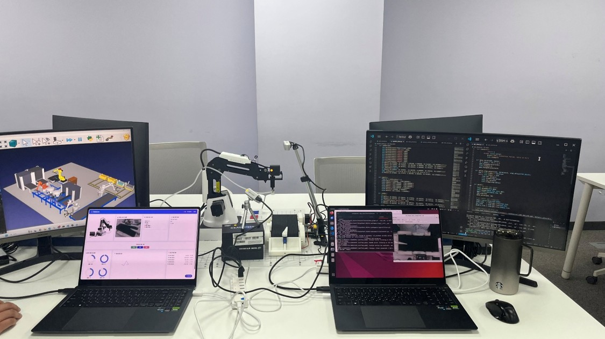
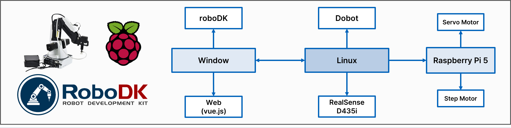
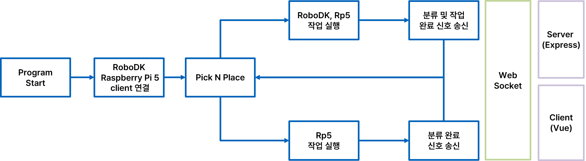
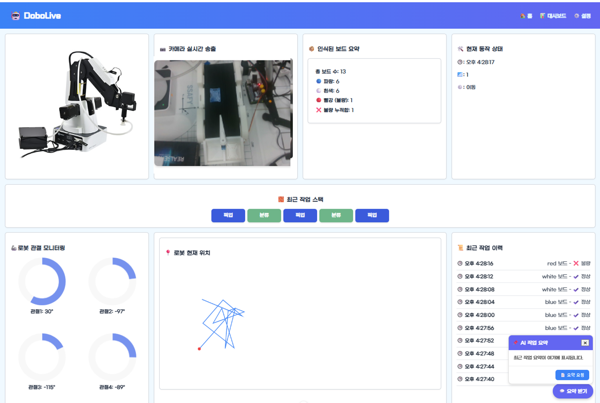

## 📦 스마트 TV 생산라인 자동화 및 시각화 프로젝트

본 프로젝트는 스마트 TV 부품 조립 공정을 자동화하고, 각 단계의 상태를 실시간으로 웹 대시보드로 시각화하는 **스마트 팩토리 솔루션**입니다.  
**Dobot 로봇팔**, **컨베이어벨트**, **RealSense + YOLO 기반 비전 인식**, **RoboDK 시뮬레이션**, **Raspberry Pi 하드웨어 제어**,  
그리고 **Vue.js 기반 웹 시각화**가 통합된 시스템입니다.

 


### 전체 시스템 구성도




### 개발 타임라인 요약

- **5/22 (목)**  
  - Dobot이 패널을 집어 컨베이어 벨트에 배치하는 Pick & Place 루틴 구현  
  - 전체 패널에 대해 반복적으로 동작하도록 구성

- **5/23 (금)**  
  - YOLO 기반 분류 결과를 서버에서 수신하고, RoboDK 시뮬레이터로 신호 전달하여 작업 동작 연동  
  - RoboDK가 신호(job 코드)에 따라 조립 단계별 시뮬레이션을 수행하도록 구현  
  - Dobot → 카메라 분류 → 라즈베리파이 컨베이어 제어 → RoboDK 시뮬레이션까지 전체 흐름 연동 완료

- **5/26 (월)**  
  - Vue.js 기반 실시간 시각화 대시보드 개발  
  - 로봇 상태 정보(관절 각도, 위치, 분류 결과 등)를 WebSocket을 통해 실시간 전송 및 시각화

- **5/27 (화)**  
  - 전체 시스템 통합 테스트 완료  
  - 작업 로그를 요약해주는 AI 기능(SummaryBot) 추가 구현


### 주요 구성 요소

#### ROS2 기반 제어 (`main_prog.py`)
- Dobot 로봇팔을 ROS2 액션과 서비스로 제어
- 컨베이어 및 RoboDK와 소켓 통신
- 작업 상태 및 좌표, 관절각 데이터를 Express 서버에 전송

#### 실시간 객체 분류 (`realSensewithYOLOv5.py`)
- RealSense 카메라로 패널을 촬영
- YOLOv5 모델로 색상/종류 인식
- 인식 결과를 ROS2 토픽 `/detection_results`로 송신

#### 하드웨어 제어 (`rp5_client.py`)
- Raspberry Pi에서 서보/스텝모터 제어 (GPIO 18, 27)
- 명령어 기반으로 분류 후 동작 (R: 불량, B: 정상, S: 스텝모터 구동)

#### RoboDK 시뮬레이터 연동 (`roboDK_client.py`)
- WebSocket 클라이언트로 명령 수신
- signal 값에 따라 각기 다른 조립 작업 수행

#### Express 서버 (`server/index.js`)
- `/update-status` API로 ROS2에서 수신한 상태 전송
- WebSocket을 통해 Vue 대시보드로 실시간 브로드캐스트
- 작업 로그 요약을 위한 GPT 요약 기능 포함

#### Vue 대시보드 (`dashboard.vue`)
- 실시간 관절 각도 도넛 차트 (ArmAngleChart)
- 현재 위치 표시 (PositionMap)
- 작업 이력, 불량 보드 수, 현재 상태, 카메라 스트림 시각화
- WebSocket을 통해 서버에서 실시간 데이터 수신


### 주요 특징

- **작업 상태(픽업/이동/분류)**별 실시간 표시
- **관절 각도 / 현재 위치** 실시간 도넛 차트 및 맵
- **YOLOv5**로 컬러 및 패널 종류 자동 분류
- **불량(red)** 보드 탐지 시 Raspberry Pi 서보모터로 우측 분류
- **작업 로그 자동 누적 및 요약** 기능 (GPT API 활용)


### 대시보드 예시

- **로봇 관절 차트**: 관절 각도를 도넛 차트로 시각화
- **위치 지도**: Dobot 위치 좌표 표시
- **작업 로그**: 작업 흐름 실시간 출력
- **통계**: 총 생산 보드 수, 색상 별 비율 표시


### 실행 방법

```bash
# 1. ROS2 메인 제어 실행
ros2 run <your_pkg> main_prog.py

# 2. RealSense + YOLO 실행
python3 realSensewithYOLOv5.py

# 3. Express 서버 실행
cd server && node index.js

# 4. Vue 대시보드 실행
cd vue-client && npm run dev

# 5. Raspberry Pi 및 RoboDK 연결 후 실행
python3 rp5_client.py
python3 roboDK_client.py

📦 robot_final_pjt
├─ main_prog.py                  # Dobot ROS2 제어
├─ realSensewithYOLOv5.py       # 실시간 분류
├─ rp5_client.py                # Raspberry Pi 모터 제어
├─ roboDK_client.py             # RoboDK 작업 분기
├─ camera_stream_server.py      # 카메라 스트리밍 서버 (선택)
├─ server/                      # Express + WebSocket 서버
├─ vue-client/                  # Vue 시각화 대시보드
└─ README.md
